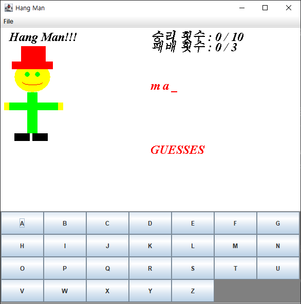
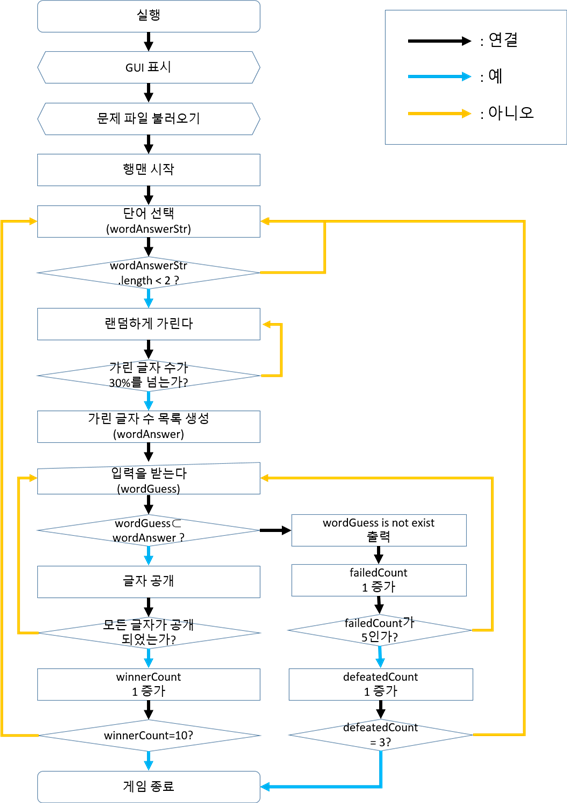

# HANG-MAN GAME

## 게임 화면



## 전체적인 흐름도



## 규칙 1

> 영어 단어가 적혀 있는 `words.txt` 파일을 읽고,
> 영어 단어 하나를 화면에 표시한다.

파일에서 글자들을 읽어와 조건에 맞게 변형하여 리턴합니다.
GUI 클래스에서 `getWordsFromFile`, `getword` 두 개의 메소드를 사용합니다

### getWordsFromFile 메소드

```java
public String[] getWordsFromFile() {
		BufferedReader reader = null;
		List<String> wordList = new ArrayList<String>();

		try {
			reader = new BufferedReader(new FileReader(FILE));
			String s = null;
			while ((s = reader.readLine()) != null) {
				if (s.length() > 2 && Pattern.matches("^[a-zA-Z]*$", s)) {
					wordList.add(s.toLowerCase());
				}
			}
		} catch (IOException e) {
			System.out.println(e.getMessage());
			System.exit(-1);
		} finally {
			try {
				reader.close();
			} catch (IOException e) {
				System.out.println(e.getMessage());
				System.exit(-1);
			}
		}
		return wordList.toArray(new String[wordList.size()]);
	}
```

- 메소드 매개변수는 없고, 리턴타입은 String[] 입니다.
- 지역변수 정의
  - BufferedReader `reader`
    - 파일에서 글자를 읽어오는 변수.
  - ArrayList<String> `wordlist`
    - 문자열을 list 형태로 저장하는 변수.
  - String `s`
    - reader를 통해 읽어온 문자열을 `wordlist`에 저장하기 전에 임시로 저장하는 변수.
- `words.txt`에서 문자열을 BufferedReader reader로 읽어와서 `s`에 저장합니다.
- `s`가 조건에 맞으면 문자열을 소문자로 모두 변환하여 `wordlist`에 저장합니다.
  - 조건 : `s`의 길이가 `2`를 초과하고, 대문자 또는 소문자 알파벳만을 요소로 가집니다.
- 문자열을 다 읽어왔을 경우 `wordlist`를 문자열 배열로 수정해서 리턴합니다.

### getword 메소드

```java
public String getword() {
		words = getWordsFromFile();

		int n = words.length;
		int r = rGen.nextInt(n);
		String word = words[r];

		return word;
	}
```

- 메소드 매개변수는 없고, 리턴타입은 String 입니다.
- 사용된 클래스 멤버변수
  - String[] `words`
    - GUI class의 멤버변수로 정의하였습니다.
    - `getwordsFromFile`이 리턴하는 문자열 배열을 저장하는 변수입니다.
- 지역변수 정의
  - int `n` : `words` 배열의 길이를 저장할 변수입니다.
  - int `r` : 0에서 문자열 배열의 크기 사이의 무작위 정수를 저장할 변수입니다.
  - String `word` : 문자열을 저장하는 변수입니다.
- `getWordsFromFile()` 메소드를 사용하고 리턴된 문자열 배열을 `words`에 저장합니다.
- 0에서 문자열 배열의 크기 사이의 정수를 하나 결정해 `r`에 저장합니다.
- `words.length`를 `n`에 저장합니다.
- `RandomGenerator` 클래스를 이용하여 무작위 숫자를 결정합니다.
- `rGen.nextInt(n)`을 통해 0~(n-1) 사이의 무작위 정수를 r에 저장합니다.
- `words[r]`을 `word`에 저장합니다.
- `word`를 리턴합니다.

이제 `play()` 함수에서 `getword()` 함수를 호출하여 화면에 표시합니다.
`play()` 함수에 대한 내용은 규칙 2에 서술되어 있습니다.

---

## 규칙 2

> 이때 화면에 나타난 영어단어의 몇개 글자를 숨긴 다음(ex: apple —> a-ple),
> 화면에 출력하여 사용자가 단어를 맞추게 하는 게임이다.

문자열을 하나 가져와서 무작위 글자를 `_`로 치환한 뒤 리턴합니다.
GUI 클래스의 `play()` 메소드를 사용합니다.

### play() 메소드

```java
private void play() {
		wordAnswerStr = getword();
		wordAnswer = wordAnswerStr.toCharArray();
		wordGuess = new char[wordAnswer.length];

		int wordHideCount = 0;
		int wordHideMax = (int) (Math.floor(wordAnswer.length * 3 / 10));

		for (int i = 0; i < wordGuess.length; i++) {
			wordGuess[i] = wordAnswer[i];
			if (Math.random() < 0.3 && wordHideCount < wordHideMax) {
				wordGuess[i] = '_';
				wordHideCount++;
			}
			if (wordHideCount == 0 && i == wordGuess.length - 1) {
				wordGuess[i] = '_';
				wordHideCount++;
			}
		}
	}
```

- 메소드 매개변수 및 리턴타입은 없습니다.
- 사용된 클래스 멤버변수
  - String `wordAnswerStr` : 게임의 대상이 될 문자열을 저장하는 변수입니다.
  - char[] `wordAnswer` : 컴퓨터가 가지고있을 정답입니다.
  - char[] `wordGuess` : 사용자에게 보여지는 문자열입니다. \_으로 치환된 캐릭터 배열입니다.
- 지역변수 정의
  - int `wordHideCount` : `_`로 치환된 글자의 개수를 저장하기 위한 변수입니다.
  - int `wordHideMax` : 규칙 3을 위한 변수입니다. 추후에 서술하겠습니다.
- `getword()` 메소드를 통해 문자열 하나를 가져와 `wordAnswerStr`에 저장합니다.
- `wordAnswerStr`을 캐릭터 배열로 변환하여 `wordAnswer`에 저장합니다.
- `wordGuess`에 `wordAnswer`과 같은 크기를 가지는 문자열 객체를 생성합니다.
- `wordHideCount`를 `0`으로 초기화합니다.
- 문자열의 일부분을 \_로 치환하여 `wordGuess`에 저장합니다.
  - `for (int i = 0; i < wordGuess.length; i++)` 반복문을 사용합니다.
  - `i`번째 `wordAnswer`값을 `wordGuess`의 `i`번째 값에 저장합니다.
  - `i`번째 `wordGuess` 값을 `_`로 치환할지 안할지를 무작위로 결정합니다.
    - `Math.random()` 함수를 사용하여 그것이 `0.3`보다 작으면
      `wordGuess`의 `i`번째 값을 `_`로 치환하고,
      `wordHideCount`를 `1` 증가시킵니다.
    - 이때 규칙 3도 함께 적용되는데, 다음 페이지에서 설명드리겠습니다.
  - `i`가 문자열의 마지막을 가리킬 때, 앞에서 `_`로 변환된 문자열이 아무것도 없으면,
    즉 `wordHideCount == 0`이면, `i`번째 글자를 `_`로 반드시 치환합니다.
  - 이후 사용자에겐 `wordGuess` 배열을 화면에 출력해서
    `wordAnswer`를 맞추도록 한다.

메소드가 모두 정의되었습니다.
이제 `play()` 메소드를 사용하여 규칙 2를 구현합니다.

---

## 규칙 3

> 숨김 글자의 수는 random 기능을 이용하여
> 전체 단어의 갯수의 30%가 넘지 않도록한다.

규칙 3은 규칙 2에서 서술한 `play()` 메소드에서 함께 적용됩니다.

- 지역변수 정의
  - int `wordHideMax` : `wordHideCount`의 최댓값을 저장할 변수입니다.
- `wordHideMax`를 문자열의 길이에 `3 / 10`을 곱한 후 소수점을 내린 값으로 합니다.
  즉, `wordHideMax`는 문자열의 길이의 `30%`에 해당하는 정수입니다.
- `wordGuess` 문자열의 일부분을 `_`로 치환하여 `wordGuess`에 저장합니다.
  - 반복문을 통해 구현합니다. `for(int i=0;i<wordGuess.length;i++)` 구문을 사용합니다.
  - `i`번째 `wordAnswer`값을 `wordGuess`의 `i`번째 값에 저장합니다.
  - `i`번째 `wordGuess` 값을 `_`로 치환할지 안할지를 무작위로 결정합니다.
    - **조건 1 : `Math.random` 함수를 사용하여 그것이 `0.3`보다 작은가?**
    - **조건 2 : `wordHideMax`가 `wordHideCount`보다 큰 가?**
    - **조건 1과 2를 모두 만족해야 `wordGuess`의 `i`번째 값을 `_`로 치환하고
      `wordHideCount`를 `1` 증가시킵니다.**

`play()`를 사용하여 규칙 3을 적용합니다.
규칙 2와 규칙 3은 동시에 적용됩니다.

---

## 규칙 4

> 한 단어에 대해 5번 틀리면 새로운 단어를 보여준다.

### inputLetter 메소드

```java
public void inputLetter(String letter) {
		System.out.println("Input Letter : " + letter);
		letter = letter.toLowerCase();
		char letterChar = letter.charAt(0);

		if (!guessList.contains(letter)) {
			if (wordAnswerStr.contains(letter)) {
				for (int i = 0; i < wordAnswer.length; i++) {
					if (letterChar == wordAnswer[i]) {
						wordGuess[i] = letterChar;
					}
				}
			}

			if (!wordAnswerStr.contains(letter)) {
				JOptionPane.showMessageDialog(null, letter + " is not exist");
				failedCount++;
			}

			guessList += letter;
			if (failedCount < 6 && !isWinner()) {
				guessList += ",";
			}

			repaint();

			result();
		}
	}
```

- 파라미터
  - String `letter` : 사용자가 입력한 문자입니다.
- 지역 변수
  - char `letterChar` : 입력된 `letter`를 소문자로 변환하고 char로 저장된 변수입니다.
- 사용자가 제시한 문자 `letterChar`를 `wordGuess[i]`에 포함하는지 확인합니다.
  사용자가 이미 입력한 문자를 누를 경우 무시하도록 하고,
  사용자가 입력하지 않은 문자면 다음 절차를 진행합니다.
- for문을 이용해 `wordAnswer`의 길이만큼 `letterChar`와 비교를 반복합니다.
- 반복 과정이 끝나고 일치하는 결과가 없는 경우 `failedCount`를 `1` 증가시킵니다.
- `failedCount` 값에 따라 화면에 도형을 그립니다.
- `failedCount` 값이 5일 때 `defeatedCount`를 `1` 증가시킵니다.
  (규칙 5에서 `result()`함수에 대해 서술)
- `defeatedCount` < 3 일 경우 다시 단어를 정하고,
  임의의 글자를 치환자로 치환하여 표시합니다.
  (규칙 5에서 `result()`함수에 대해 서술)

---

## 규칙 5

> 게임 종료의 조건은 10문항을 맞추거나,
> 3번 문제를 틀리면 게임을 종료한다.

### result 메소드

```java
private void result() {
		if (isWinner()) {
			JOptionPane.showMessageDialog(null, "Correct!!");
			winnerCount++;
			playReset();
		}

		if (failedCount >= 5) {
			JOptionPane.showMessageDialog(null, "Fail!!");
			defeatedCount++;
			playReset();
		}

		if (defeatedCount >= 3) {
			JOptionPane.showMessageDialog(null, "You Lose");
			exit();
		}

		if (winnerCount >= 10) {
			JOptionPane.showMessageDialog(null, "You Win");
			exit();
		}
	}
```

- `failedCount` >= 5가 되면 ,
  `"Fail!!"` 메시지를 출력한 후,
  `defeatedCount`를 1 증가시키고, 다음 단어로 게임을 진행합니다.
- `defeatedCount` >= 3이 될 경우,
  `"You Lose"` 메시지를 출력하고, `exit()` 메소드를 호출해서 프로그램을 종료합니다.
- `Arrays.equals(wordGuess, wordAnswer)` 일 경우, (isWinner()이 true일 경우)
  `“Correct!!”` 메시지를 출력한 후,
  `winnerCount`를 1 증가시키고, 다음 단어로 게임을 진행합니다.
- `winnerCount` >= 10이 될 경우,
  `"You Win"` 메시지를 출력하고, `exit()` 메소드를 호출해서 프로그램을 종료합니다.

---

## 규칙 6

> GUI 프로그램으로 개발한다.

[GUI 개발을 위해 사용한 패키지 ](https://www.notion.so/b47381c99bd344738eb56d90470c3b37)

### Title 설정

- `title`은 `super(“Hang man”)`를 통해 `Hang man`으로 설정한다.

  ```java
  // 게임 제목
  super("Hang Man");
  ```

### Frame 설정

- `WIDTH`, `HEIGHT` 변수를 각각 `600`으로 정의하고
  `setSize(WIDTH, HEIGHT)`를 통해 프레임의 크기를 설정한다.
- `setDefaultCloseOperation(JFrame.EXIT_ON_CLOSE)` 명령어를 통해
  Frame이 닫힐 때 프로그램도 같이 종료되도록 한다.

      ```java
      // set size of the jframe
      setSize(WIDTH, HEIGHT);
      // populate word array
      words = getWordsFromFile();
      // close Jframe on exit
      setDefaultCloseOperation(JFrame.EXIT_ON_CLOSE);
      ```

### Menu 설정

- 게임의 메뉴는 `createMenuBar()` method를 통해 생성한다.
- `setJMenuBar(menuBar)` method를 통해 메뉴바를 생성한다.
- `menuBar.add(fileMenu)`를 통해 메뉴바에 File 메뉴를 넣어준다.
- `creatMenuItem(fileMenu, PLAY_START)`, `creatMenuItem(fileMenu, PLAY_EXIT)`를 통해
  “File”의 하위메뉴인 “PLAY”와 “EXIT”을 넣어 준다.

      ```java
      // method creates menu and menuitems
      	public void createMenuBar() {
      		JMenuBar menuBar = new JMenuBar();
      		setJMenuBar(menuBar);

      		// create file menu
      		JMenu fileMenu = new JMenu("File");
      		menuBar.add(fileMenu);

      		// add menu items
      		createMenuItem(fileMenu, PLAY_START);
      		createMenuItem(fileMenu, PLAY_EXIT);
      	}
      ```

### 화면 설정

- `mainPanel = new JPanel()`을 통해 `mainPanel`을 생성한 후
  `mainPanel.setLayout(new GridLayout(3,0))`을 통해 화면을 3개로 분할하고,
  `mainPanel.setBackground(Color.WHITE)`를 통해 배경을 흰색으로 정의한다.
- `rightPanel`, `leftPanel`, `bottomPanel`을 각기 정의하고
  `rightPanel`과 `leftPanel`은 `mainPanel`과 동일한 방식을 사용하여 배경을 흰색으로,
  `bottomPanel`을 회색으로 지정한다.
- `rightPanel`과 `leftPanel`은 `mainPanel.add(rightPanel)`, `mainPanel.add(leftPanel)`에 의해 `mainPanel` 위에 보여지게 된다.
- `bottomPanel`은 `mainPanel.add(bottomPanel, BorderLayout.SOUTH)`에 의해
  `mainPanel`의 하단에 보여지게 된다.

      ```java
      		// main panel houses three panels - left, right and bottom(keyboard).
      		mainPanel = new JPanel();
      		mainPanel.setLayout(new GridLayout(3, 0));
      		mainPanel.setBackground(Color.WHITE);

      		rightPanel = new JPanel();
      		leftPanel = new JPanel();
      		leftPanel.setBackground(Color.WHITE);
      		rightPanel.setBackground(Color.WHITE);
      		// add the left/right panel
      		mainPanel.add(leftPanel);
      		mainPanel.add(rightPanel);
      		bottomPanel = new JPanel();
      		bottomPanel.setLayout(new GridLayout(4, 4));
      		bottomPanel.setBackground(Color.GRAY);
      		// add the bottom panel which contains Jbuttons
      		mainPanel.add(bottomPanel, BorderLayout.SOUTH);

      		belowPanel = new JPanel();
      		belowPanel.setBackground(Color.GREEN);
      		// add last panel which houses replay/exit button
      		add(mainPanel);
      		add(belowPanel, BorderLayout.AFTER_LAST_LINE);

      		// set visibility to false until game is over
      		belowPanel.setVisible(false);
      ```

### 자판 설정

- `bottomPanel`은 `creatButtons(Jpanel bottomPanel)` method를 통해
  각 알파벳을 입력 할 수 있는 자판이 주어진다.
- 버튼 26개를 새로이 정의하고, 버튼에 넣을 알파벳의 리스트 `inputLetter`를 생성한다.
- for문을 이용, 각 버튼에게 `buttons[i] = new JButton(inputLetter[i])`를 통해
  알파벳을 부여하고 버튼의 size는 `buttons[i].setSize(40,40)`을 통해 설정한다.
- 이후 버튼을 눌렀을 때의 액션은 `buttons[i].addActionListener(this)`를 사용하여 설정하고,
  마지막으로 `bottomPanel.add(buttons[i])`를 통해
  `bottomPanel`위에 각 `button`을 보이게 설정한다.

### 오답 & 성공/실패 & 승리/패배 알림창 설정

- 정답에 포함되지 않는 알파벳의 버튼을 클릭하면,
  `JOptionPane.showMessageDialog(null, letter + “ is not exist”)`에 의해
  알림창을 띄우고 잘못된 입력이라는 것을 상기시킨다. (규칙 4 코드 참고)
- `JOptionPane.showMessageDialog()` method를 통해
  성공 시 “Correct!!”가, 실패 시 “Fail!!”이, 3회 이상 실패 시 “You lose”가,
  10회 이상 성공 시 “You Win”이 알림창에 표시되도록 설정한다. (규칙 5 코드 참고)

### Hang man Graphics 설정

- 행맨은 `graphics`를 통해 도형을 생성하고 좌표를 적절히 조정하여 만든다.
- 얼굴은 `fillOval`를 통해 원으로 설정한다. 색은 `setcolor`를 통해 노란색으로 설정한다.
- 눈은 두 개의 `fillOver`를 통해 원으로 설정한다. 색은 `setcolor`로 초록색으로 설정한다.
- 웃는 입은 `drawArc`를 통해 설정한다. 색은 `setcolor`를 통해 빨간색으로 설정한다.
- 오른팔과 왼팔은 각기 `fileRect`를 통해 두 개의 사각형으로 만든다.
  색은 `setcolor`를 통해 팔부분의 사각형은 초록색, 손부분의 사각형은 노란색으로 설정한다.
- 오른발과 왼발은 각기 `fileRect`를 통해 사각형으로 만든다.
  색은 `setcolor`를 통해 검정색으로 설정한다.
- 모자는 `fillRect`를 통해 두 개의 사각형으로 만든다.
  색은 `setcolor`를 통해 빨강색으로 설정한다.
- 몸은 `fileRect`를 통해 사각형으로 설정한다. 색은 “setcolor”를 통해 녹색으로 설정한다.
- 각 도형을 생성하는 코드는 `if(failedCount < n)` 조건문에 의해 작동하며,
  `failedCount`가 0일 때는 전부를 실행시키고,
  이후 `failedCount`의 값이 늘어날 때마다 행맨의 신체 부위가 점점 사라지도록 한다.

      ```java
      private void hangman(Graphics g) {

      		if (failedCount < 5) {
      			// draw face
      			g.setColor(Color.YELLOW);
      			g.fillOval(35, 120, 70, 60);
      			// hat
      			g.setColor(Color.RED);

      			g.fillRect(48, 90, 48, 30);
      			g.fillRect(30, 120, 80, 15);

      			// draw eyes
      			g.setColor(Color.GREEN);
      			g.fillOval(55, 140, 10, 10);
      			g.fillOval(75, 140, 10, 10);

      			// smile
      			g.setColor(Color.RED);
      			g.drawArc(50, 155, 40, 10, -10, -180);
      		}

      		if (failedCount < 4) {
      			// body
      			g.setColor(Color.GREEN);
      			g.fillRect(60, 180, 20, 80);

      			// left arm
      			g.setColor(Color.GREEN);
      			g.fillRect(25, 200, 45, 15);
      			g.setColor(Color.YELLOW);
      			g.fillRect(15, 200, 10, 15);
      		}

      		if (failedCount < 3) {
      			// right arm
      			g.setColor(Color.GREEN);
      			g.fillRect(80, 200, 45, 15);
      			g.setColor(Color.YELLOW);
      			g.fillRect(120, 200, 10, 15);
      		}

      		if (failedCount < 2) {
      			// left foot
      			g.setColor(Color.BLACK);
      			g.fillRect(35, 260, 30, 15);
      		}

      		if (failedCount < 1) {
      			// right foot
      			g.setColor(Color.BLACK);
      			g.fillRect(70, 260, 30, 15);
      		}

      		g.setColor(Color.BLACK);
      	}
      ```

---

## 규칙 7

> 2글자 이하의 단어는 제외한다.

- `getwordsFromFile`을 통해 `words.txt`를 한 줄씩 읽어 간다.
- 한 줄씩 읽을 때 `3`글자 이상의 단어가 읽어진다면,
  이 단어를 모두 소문자로 바꿔 `wordList`에 추가한다.
- wordList에 저장된 단어를 행맨 게임의 단어로 사용한다.

`getwordsFromFile()` 함수에 대한 내용 등등의 자세한 내용은
규칙 1에 서술되어 있습니다.
